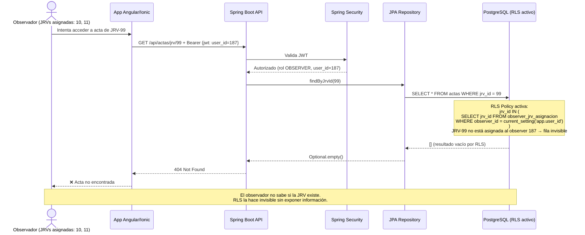

# Flujo 07 — Acceso Denegado por RLS (JRV No Asignada)

Escenario: un observador intenta registrar o consultar el acta de una JRV que no tiene asignada.

```mermaid
sequenceDiagram
    actor OBS as Observador (JRVs asignadas: 10, 11)
    participant APP as App Angular/Ionic
    participant API as Spring Boot API
    participant SEC as Spring Security
    participant JPA as JPA Repository
    participant PG as PostgreSQL (RLS activo)

    OBS->>APP: Intenta acceder a acta de JRV-99
    APP->>API: GET /api/actas/jrv/99 + Bearer {jwt: user_id=187}

    API->>SEC: Valida JWT
    SEC-->>API: Autorizado (rol OBSERVER, user_id=187)

    API->>JPA: findByJrvId(99)
    JPA->>PG: SELECT * FROM actas WHERE jrv_id = 99

    Note over PG: RLS Policy activa:<br/>jrv_id IN (<br/>  SELECT jrv_id FROM observer_jrv_asignacion<br/>  WHERE observer_id = current_setting('app.user_id')<br/>)<br/>JRV-99 no está asignada al observer 187 → fila invisible

    PG-->>JPA: [] (resultado vacío por RLS)
    JPA-->>API: Optional.empty()
    API-->>APP: 404 Not Found

    APP-->>OBS: ❌ Acta no encontrada

    Note over OBS,PG: El observador no sabe si la JRV existe.<br/>RLS la hace invisible sin exponer información.
```
