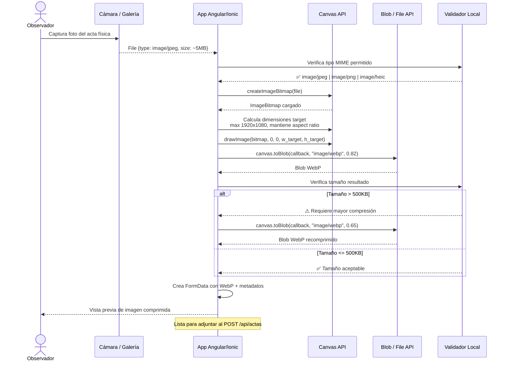

# Flujo 08 — Pipeline de Compresión de Imagen en el Cliente

Escenario: detalle interno del proceso de captura y compresión antes de transmitir la evidencia.

```mermaid
sequenceDiagram
    actor OBS as Observador
    participant CAM as Cámara / Galería
    participant APP as App Angular/Ionic
    participant CANVAS as Canvas API
    participant BLOB as Blob / File API
    participant VAL as Validador Local

    OBS->>CAM: Captura foto del acta física
    CAM-->>APP: File {type: image/jpeg, size: ~5MB}

    APP->>VAL: Verifica tipo MIME permitido
    VAL-->>APP: ✅ image/jpeg | image/png | image/heic

    APP->>CANVAS: createImageBitmap(file)
    CANVAS-->>APP: ImageBitmap cargado

    APP->>CANVAS: Calcula dimensiones target<br/>max 1920x1080, mantiene aspect ratio
    APP->>CANVAS: drawImage(bitmap, 0, 0, w_target, h_target)

    APP->>BLOB: canvas.toBlob(callback, "image/webp", 0.82)
    BLOB-->>APP: Blob WebP

    APP->>VAL: Verifica tamaño resultado
    alt Tamaño > 500KB
        VAL-->>APP: ⚠️ Requiere mayor compresión
        APP->>BLOB: canvas.toBlob(callback, "image/webp", 0.65)
        BLOB-->>APP: Blob WebP recomprimido
    else Tamaño <= 500KB
        VAL-->>APP: ✅ Tamaño aceptable
    end

    APP->>APP: Crea FormData con WebP + metadatos
    APP-->>OBS: Vista previa de imagen comprimida
    Note over APP: Lista para adjuntar al POST /api/actas
```
